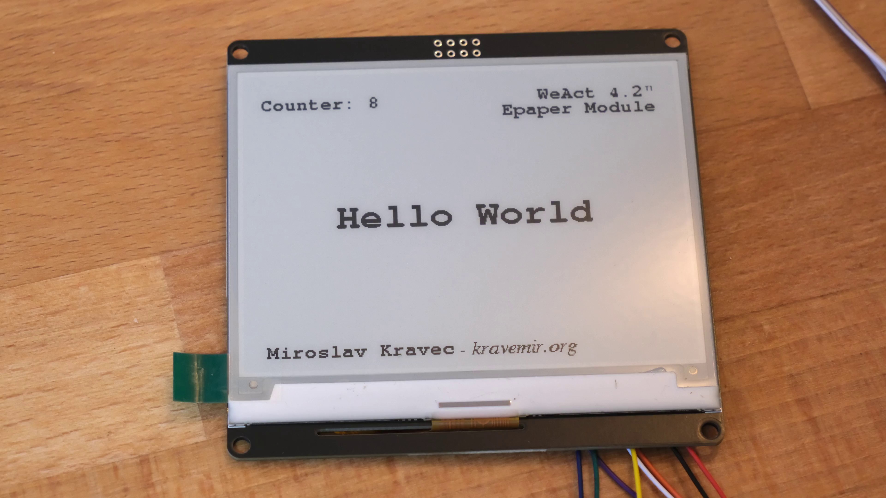

import ContentImage from "src/components/content/Image.astro";
import { Image } from 'astro:assets';
import img from "./images/closer_look.jpg"

<ContentImage alt={frontmatter.images.closerLook.alt} image={frontmatter.images.closerLook.image}/>

<div>{JSON.stringify(frontmatter)}</div>


<Image src={img} alt="asdas" layout='constrained'  />

[//]: # (::)

## Prerequisites

Main parts:

- ESP32 development board (not yet tested on Arduino),
- WeAct 4.2" Epaper module,
- other wiring ingredients of yours choice.

[//]: # (::content-image{:alt="images.components.alt" :image="images.components.image"})

[//]: # (::)

# Wiring

Connecting ESP32 development board and Epaper Module:

- D4 - BUSY
- RX2 - RES
- TX2 - D/C
- D5 - CS
- D18 - SCL
- D23 - SDA
- GND - GND
- 3V3 - VCC

[//]: # (::content-image{:alt="images.wiring.alt" :image="images.wiring.image"})

[//]: # (::)

## Full source code for ESP32

Source code:

```cpp
#define ENABLE_GxEPD2_GFX 0

#include <GxEPD2_BW.h>
#include <Fonts/FreeMonoBold18pt7b.h>
#include <Fonts/FreeMonoBold9pt7b.h>
#include <Fonts/FreeSerifItalic9pt7b.h>

// WeAct 4.2" Epaper Module
GxEPD2_BW<GxEPD2_420_GDEY042T81, GxEPD2_420_GDEY042T81::HEIGHT> display(GxEPD2_420_GDEY042T81(/*CS=5*/ SS, /*DC=*/ 17, /*RST=*/ 16, /*BUSY=*/ 4));

void setup()
{
  display.init(115200, true, 50, false);

  helloWorld();
  delay(1000);

  fullRedraw();
  delay(1000);

  helloWorld();
  delay(1000);

  showPartialUpdate();

  display.hibernate();
}

void helloWorld()
{
  display.setRotation(0);
  display.setTextColor(GxEPD_BLACK);

  int16_t tbx, tby; uint16_t x, y, tbw, tbh;

  display.setFullWindow();
  display.firstPage();
  do
  {
    display.fillScreen(GxEPD_WHITE);

    display.setFont(&FreeMonoBold18pt7b);
    display.getTextBounds("Hello World", 0, 0, &tbx, &tby, &tbw, &tbh);
    x = ((display.width() - tbw) / 2) - tbx;
    y = ((display.height() + tbh) / 2) - tby;
    display.setCursor(x, y - tbh);
    display.print("Hello World");

    display.setFont(&FreeMonoBold9pt7b);
    display.getTextBounds("WeAct 4.2\"", 0, 0, &tbx, &tby, &tbw, &tbh);
    x = (display.width() - tbw) - 20 - tbx;
    y = 20;
    display.setCursor(x, y - tby);
    display.print("WeAct 4.2\"");
    y = y + tbh + 5;

    display.setFont(&FreeMonoBold9pt7b);
    display.getTextBounds("Epaper Module", 0, 0, &tbx, &tby, &tbw, &tbh);
    x = (display.width() - tbw) - 20 - tbx;
    display.setCursor(x, y - tby);
    display.print("Epaper Module");

    x = 20;
    y = display.height() - 12;

    display.setFont(&FreeMonoBold9pt7b);
    display.getTextBounds("Miroslav Kravec", 0, 0, &tbx, &tby, &tbw, &tbh);
    y = y - tbh;
    display.setCursor(x - tbx, y - tby);
    display.print("Miroslav Kravec");
    x = x + tbw;

    display.setFont(&FreeSerifItalic9pt7b);
    display.getTextBounds(" - kravemir.org", 0, 0, &tbx, &tby, &tbw, &tbh);
    display.setCursor(x - tbx, y  - tby);
    display.print(" - kravemir.org");

    display.setFont(&FreeMonoBold18pt7b);
  }
  while (display.nextPage());
}

void fullRedraw()
{
  display.setRotation(0);
  display.setTextColor(GxEPD_BLACK);

  int16_t tbx, tby; uint16_t x, y, tbw, tbh;

  display.setFullWindow();
  display.firstPage();
  do
  {
    display.fillScreen(GxEPD_WHITE);

    display.setFont(&FreeMonoBold18pt7b);
    display.getTextBounds("Full Refresh", 0, 0, &tbx, &tby, &tbw, &tbh);
    x = ((display.width() - tbw) / 2) - tbx;
    y = ((display.height() + tbh) / 2) - tby;
    display.setCursor(x, y - tbh);
    display.print("Full Refresh");
  }
  while (display.nextPage());
}

void showPartialUpdate()
{
  char textBuffer[50];

  uint16_t box_x = 16;
  uint16_t box_y = 12;
  uint16_t box_w = 200;
  uint16_t box_h = 30;

  uint16_t cursor_y = box_y + box_h - 6;
  uint16_t incr = display.epd2.hasFastPartialUpdate ? 1 : 3;
  
  display.setFont(&FreeMonoBold9pt7b);
  display.setTextColor(GxEPD_BLACK);

  display.setPartialWindow(box_x, box_y, box_w, box_h);
  for (uint16_t i = 1; i <= 10; i += incr)
  {
    display.firstPage();
    do
    {
      sprintf(textBuffer, "Counter: %d", i);
      display.fillRect(box_x, box_y, box_w, box_h, GxEPD_WHITE);
      display.setCursor(box_x, cursor_y);
      display.print(textBuffer);
    }
    while (display.nextPage());
    delay(500);
  }
  delay(1000);
  
  display.firstPage();
  do
  {
    display.fillRect(box_x, box_y, box_w, box_h, GxEPD_WHITE);
    display.setCursor(box_x, cursor_y);
    display.print("Finished counting");
  }
  while (display.nextPage());
}

void loop() {
  // no loop
}
```

## Demonstration video

Demonstration of functionality with ESP32:

<iframe class="youtube" width="560" height="315" src="https://www.youtube.com/embed/VWVlwO9dve0?si=wr1Obc1f5ba-5dP6" title="YouTube video player" frameborder="0" allow="accelerometer; autoplay; clipboard-write; encrypted-media; gyroscope; picture-in-picture; web-share" referrerpolicy="strict-origin-when-cross-origin" allowfullscreen></iframe>
