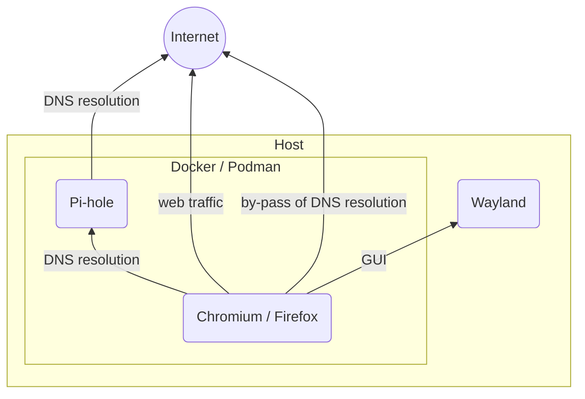
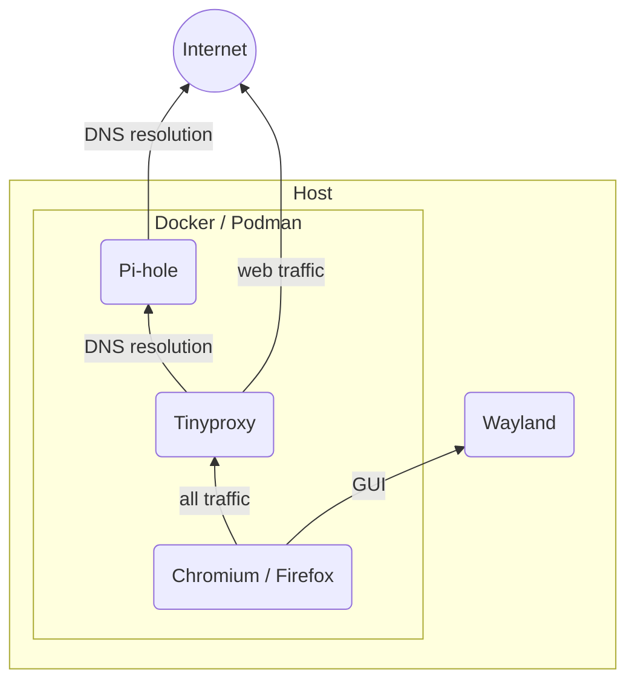

Wayland host is assumed. The execution of browsers in containers depends on presence of Wayland session in the host. This is more described in my [previous guide](../run-graphical-application-in-container-with-sommelier-wayland-and-xwayland/).

## Pi-hole and browsers (only)

In the first stage, we'll create only Pi-hole and browsers in containers.

And, we'll demonstrate it's not enough, but can be easily bypassed.



### Container images for browsers

We will use custom container images based on Debian, and install browsers from Debian packages.

Create `debian-chromium.Dockerfile` for custom image containing Chromium and dig:

```Dockerfile
FROM debian:12

# install Chromium, dnsutils (dig) and iputils-ping (ping)
RUN apt-get update && \
    apt-get install -y chromium && \
    apt-get install -y dnsutils iputils-ping && \
    rm -rf /var/lib/apt/lists/*

# Set non-root user and group
ARG user=appuser
ARG group=appuser
ARG uid=1000
ARG gid=1000
RUN groupadd -g ${gid} ${group} -f
RUN useradd -u ${uid} -g ${group} -m ${user}

USER ${uid}:${gid}
```

Create `debian-firefox.Dockerfile` for custom image containing Chromium and dig:

```Dockerfile
FROM debian:12

# install Firefox, dnsutils (dig) and iputils-ping (ping)
RUN apt-get update && \
    apt-get install -y firefox-esr && \
    apt-get install -y dnsutils iputils-ping && \
    rm -rf /var/lib/apt/lists/*

# Set non-root user and group
ARG user=appuser
ARG group=appuser
ARG uid=1000
ARG gid=1000
RUN groupadd -g ${gid} ${group} -f
RUN useradd -u ${uid} -g ${group} -m ${user}

USER ${uid}:${gid}
```

### Run it with Docker compose

Create `docker-compose-pihole.yaml`:

```yaml
services:
  pihole:
    image: pihole/pihole:2025.10.3
    ports:
      # allow external access to Pi-hole admin
      - "8080:80/tcp"
    environment:
      TZ: "Europe/Bratislava"
      FTLCONF_webserver_api_password: 'admin'
      DNSMASQ_LISTENING: all
    networks:
      custom_bridge:
        ipv4_address: 10.0.11.2
    restart: "no"
  chromium:
    image: debian-chromium
    build:
      context: .
      dockerfile: debian-chromium.Dockerfile
      args:
        uid: "$USER_UID"
        gid: "$USER_GID"
    depends_on:
      - pihole
    networks:
      - custom_bridge
    environment:
      XDG_RUNTIME_DIR: /tmp
      WAYLAND_DISPLAY: $WAYLAND_DISPLAY
    dns:
      - 10.0.11.2
    volumes:
      - type: bind
        source: $XDG_RUNTIME_DIR/$WAYLAND_DISPLAY
        target: /tmp/$WAYLAND_DISPLAY
    command: chromium --no-sandbox --ozone-platform=wayland
    restart: "no"
  firefox:
    image: debian-firefox
    build:
      context: .
      dockerfile: debian-firefox.Dockerfile
      args:
        uid: "$USER_UID"
        gid: "$USER_GID"
    depends_on:
      - pihole
    networks:
      - custom_bridge
    environment:
      XDG_RUNTIME_DIR: /tmp
      WAYLAND_DISPLAY: $WAYLAND_DISPLAY
      MOZ_ENABLE_WAYLAND: '1'
    dns:
      - 10.0.11.2
    volumes:
      - type: bind
        source: $XDG_RUNTIME_DIR/$WAYLAND_DISPLAY
        target: /tmp/$WAYLAND_DISPLAY
    command: firefox
    restart: "no"

networks:
  custom_bridge:
    driver: bridge
    ipam:
      config:
        - subnet: 10.0.11.0/24
          ip_range: 10.0.11.128/25
```

Launch containers with following commands:

```shell
# export user-related environment to be used by compose
export USER_UID=$(id -u) 
export USER_GID=$(id -g)

# start Pi-hole in the background
docker compose -f docker-compose-pihole.yaml up -d pihole

# open browser(s)
docker compose -f docker-compose-pihole.yaml up chromium
docker compose -f docker-compose-pihole.yaml up firefox
```

Demonstration of bypassing Pi-hole:

```shell
# while running browser container, exec into it (can be either one)
docker compose -f docker-compose-pihole.yaml exec chromium /bin/bash

  # in container, test ping Google DNS
  ping 8.8.8.8
  
  # in container, try resolve something - will not show in pi-hole
  dig will-not-show @8.8.8.8
```

### Run it with Podman compose

Create `podman-compose.yaml`:

```yaml
x-podman:
  in_pod: false

services:
  pihole:
    image: pihole/pihole:2025.10.3
    ports:
      # allow external access to Pi-hole admin
      - "8080:80/tcp"
    environment:
      TZ: "Europe/Bratislava"
      FTLCONF_webserver_api_password: 'admin'
      DNSMASQ_LISTENING: all
    networks:
      custom_bridge:
        ipv4_address: 10.0.31.2
    restart: "no"
  chromium:
    image: debian-chromium
    build:
      context: .
      dockerfile: debian-chromium.Dockerfile
      args:
        uid: "$USER_UID"
        gid: "$USER_GID"
    depends_on:
      - pihole
    networks:
      - custom_bridge
    environment:
      XDG_RUNTIME_DIR: /tmp
      WAYLAND_DISPLAY: $WAYLAND_DISPLAY
    dns:
      - 10.0.31.2
    userns_mode: "keep-id:uid=$USER_UID,gid=$USER_GID"
    volumes:
      - type: bind
        source: $XDG_RUNTIME_DIR/$WAYLAND_DISPLAY
        target: /tmp/$WAYLAND_DISPLAY
    command: chromium --no-sandbox --ozone-platform=wayland
    restart: "no"
  firefox:
    image: debian-firefox
    build:
      context: .
      dockerfile: debian-firefox.Dockerfile
      args:
        uid: "$USER_UID"
        gid: "$USER_GID"
    depends_on:
      - pihole
    networks:
      - custom_bridge
    environment:
      XDG_RUNTIME_DIR: /tmp
      WAYLAND_DISPLAY: $WAYLAND_DISPLAY
      MOZ_ENABLE_WAYLAND: '1'
    dns:
      - 10.0.31.2
    userns_mode: "keep-id:uid=$USER_UID,gid=$USER_GID"
    volumes:
      - type: bind
        source: $XDG_RUNTIME_DIR/$WAYLAND_DISPLAY
        target: /tmp/$WAYLAND_DISPLAY
    command: firefox
    restart: "no"

networks:
  custom_bridge:
    driver: bridge
    ipam:
      config:
        - subnet: 10.0.31.0/24
```

Launch containers with following commands:

```shell
# export user-related environment to be used by compose
export USER_UID=$(id -u) 
export USER_GID=$(id -g)

# start Pi-hole in the background
podman compose -f podman-compose-pihole.yaml up -d pihole tinyproxy

# open browser(s)
podman compose -f podman-compose-pihole.yaml up chromium
podman compose -f podman-compose-pihole.yaml up firefox
```

Demonstration of bypassing Pi-hole:

```shell
# while running browser container, exec into it (can be either one)
podman compose -f podman-compose-pihole.yaml exec chromium /bin/bash

  # in container, test ping Google DNS
  ping 8.8.8.8
  
  # in container, try resolve something - will not show in pi-hole
  dig will-not-show @8.8.8.8
```

## Tinyproxy, Pi-hole and browsers

Isolation of container from arbitrary access to outside network is needed to prevent bypassing of Pi-hole.  One way is to add a firewall in between container and outside network access. However,...

When only HTTP(s) access is needed, it is quite easy to create a Tinyproxy and allow container to connect only to this proxy.



### Container image for Tinyproxy

We will use custom container images based on Alpine Linux, and install Tinyproxy from its packages.

Create `alpine-tinyproxy.Dockerfile` for custom image containing Tinyproxy:

```Dockerfile
FROM alpine:3.22

# install tinyproxy
RUN apk add --no-cache tinyproxy

# create config file
RUN mkdir -p /etc/tinyproxy && \
    echo "User nobody" > /etc/tinyproxy/tinyproxy.conf && \
    echo "Group nogroup" >> /etc/tinyproxy/tinyproxy.conf && \
    echo "Port 8888" >> /etc/tinyproxy/tinyproxy.conf && \
    echo "Listen 0.0.0.0" >> /etc/tinyproxy/tinyproxy.conf && \
    echo "Timeout 600" >> /etc/tinyproxy/tinyproxy.conf && \
    echo "LogLevel Info" >> /etc/tinyproxy/tinyproxy.conf && \
    echo "PidFile \"/tmp/tinyproxy.pid\"" >> /etc/tinyproxy/tinyproxy.conf && \
    echo "MaxClients 100" >> /etc/tinyproxy/tinyproxy.conf && \
    echo "Allow 0.0.0.0/0" >> /etc/tinyproxy/tinyproxy.conf && \
    echo "ConnectPort 443" >> /etc/tinyproxy/tinyproxy.conf && \
    echo "ViaProxyName \"tinyproxy-container\"" >> /etc/tinyproxy/tinyproxy.conf

# switch to non-root user
USER nobody

CMD ["tinyproxy", "-d", "-c", "/etc/tinyproxy/tinyproxy.conf"]
```

### Run it with Docker compose

Create `docker-compose-pihole-tinyproxy.yaml`:

```yaml
services:
  tinyproxy:
    image: alpine-tinyproxy
    build:
      context: .
      dockerfile: alpine-tinyproxy.Dockerfile
    depends_on:
      - pihole
    dns:
      - 10.0.21.2
    networks:
      outgoing_bridge: {}
      internal_bridge:
        ipv4_address: 10.0.22.2
    restart: "no"
  pihole:
    image: pihole/pihole:2025.10.3
    ports:
      # allow external access to Pi-hole admin
      - "8080:80/tcp"
    environment:
      TZ: "Europe/Bratislava"
      FTLCONF_webserver_api_password: 'admin'
      DNSMASQ_LISTENING: all
    networks:
      outgoing_bridge:
        ipv4_address: 10.0.21.2
    restart: "no"
  chromium:
    image: debian-chromium
    build:
      context: .
      dockerfile: debian-chromium.Dockerfile
      args:
        uid: "$USER_UID"
        gid: "$USER_GID"
    depends_on:
      - tinyproxy
    networks:
      - internal_bridge
    environment:
      http_proxy: http://10.0.22.2:8888
      https_proxy: http://10.0.22.2:8888
      XDG_RUNTIME_DIR: /tmp
      WAYLAND_DISPLAY: $WAYLAND_DISPLAY
    volumes:
      - type: bind
        source: $XDG_RUNTIME_DIR/$WAYLAND_DISPLAY
        target: /tmp/$WAYLAND_DISPLAY
    command: chromium --no-sandbox --ozone-platform=wayland
    restart: "no"
  firefox:
    image: debian-firefox
    build:
      context: .
      dockerfile: debian-firefox.Dockerfile
      args:
        uid: "$USER_UID"
        gid: "$USER_GID"
    depends_on:
      - tinyproxy
    networks:
      - internal_bridge
    environment:
      http_proxy: http://10.0.22.2:8888
      https_proxy: http://10.0.22.2:8888
      XDG_RUNTIME_DIR: /tmp
      WAYLAND_DISPLAY: $WAYLAND_DISPLAY
      MOZ_ENABLE_WAYLAND: '1'
    volumes:
      - type: bind
        source: $XDG_RUNTIME_DIR/$WAYLAND_DISPLAY
        target: /tmp/$WAYLAND_DISPLAY
    command: firefox
    restart: "no"

networks:
  outgoing_bridge:
    driver: bridge
    ipam:
      config:
        - subnet: 10.0.21.0/24
          ip_range: 10.0.21.128/25
  internal_bridge:
    driver: bridge
    internal: true
    ipam:
      config:
        - subnet: 10.0.22.0/24
          ip_range: 10.0.22.128/25
```

Launch containers with following commands:

```shell
# export user-related environment to be used by compose
export USER_UID=$(id -u) 
export USER_GID=$(id -g)

# start Pi-hole in the background
docker compose -f docker-compose-pihole-tinyproxy.yaml up -d pihole tinyproxy

# open browser(s)
docker compose -f docker-compose-pihole-tinyproxy.yaml up chromium
docker compose -f docker-compose-pihole-tinyproxy.yaml up firefox
```

Demonstration of isolation:

```shell
# while running browser container, exec into it (can be either one)
docker compose -f docker-compose-pihole-tinyproxy.yaml exec chromium /bin/bash

  # in container, test ping Google DNS
  ping 8.8.8.8
  
  # in container, try resolve something
  dig will-not-show @8.8.8.8
```

### Run it with Podman compose

Create `podman-compose.yaml`:

```yaml
x-podman:
  in_pod: false

services:
  tinyproxy:
    image: alpine-tinyproxy
    build:
      context: .
      dockerfile: alpine-tinyproxy.Dockerfile
    depends_on:
      - pihole
    dns:
      - 10.0.41.2
    networks:
      outgoing_bridge: {}
      internal_bridge:
        ipv4_address: 10.0.42.2
    restart: "no"
  pihole:
    image: pihole/pihole:2025.10.3
    ports:
      # allow external access to Pi-hole admin
      - "8080:80/tcp"
    environment:
      TZ: "Europe/Bratislava"
      FTLCONF_webserver_api_password: 'admin'
      DNSMASQ_LISTENING: all
    networks:
      outgoing_bridge:
        ipv4_address: 10.0.41.2
    restart: "no"
  chromium:
    image: debian-chromium
    build:
      context: .
      dockerfile: debian-chromium.Dockerfile
      args:
        uid: "$USER_UID"
        gid: "$USER_GID"
    depends_on:
      - tinyproxy
    networks:
      - internal_bridge
    environment:
      http_proxy: http://10.0.42.2:8888
      https_proxy: http://10.0.42.2:8888
      XDG_RUNTIME_DIR: /tmp
      WAYLAND_DISPLAY: $WAYLAND_DISPLAY
    userns_mode: "keep-id:uid=$USER_UID,gid=$USER_GID"
    volumes:
      - type: bind
        source: $XDG_RUNTIME_DIR/$WAYLAND_DISPLAY
        target: /tmp/$WAYLAND_DISPLAY
    command: chromium --no-sandbox --ozone-platform=wayland
    restart: "no"
  firefox:
    image: debian-firefox
    build:
      context: .
      dockerfile: debian-firefox.Dockerfile
      args:
        uid: "$USER_UID"
        gid: "$USER_GID"
    depends_on:
      - tinyproxy
    networks:
      - internal_bridge
    environment:
      http_proxy: http://10.0.42.2:8888
      https_proxy: http://10.0.42.2:8888
      XDG_RUNTIME_DIR: /tmp
      WAYLAND_DISPLAY: $WAYLAND_DISPLAY
      MOZ_ENABLE_WAYLAND: '1'
    userns_mode: "keep-id:uid=$USER_UID,gid=$USER_GID"
    volumes:
      - type: bind
        source: $XDG_RUNTIME_DIR/$WAYLAND_DISPLAY
        target: /tmp/$WAYLAND_DISPLAY
    command: firefox
    restart: "no"

networks:
  outgoing_bridge:
    driver: bridge
    ipam:
      config:
        - subnet: 10.0.41.0/24
          ip_range: 10.0.41.128/25
  internal_bridge:
    driver: bridge
    internal: true
    ipam:
      config:
        - subnet: 10.0.42.0/24
          ip_range: 10.0.42.128/25
```

Launch containers with following commands:

```shell
# export user-related environment to be used by compose
export USER_UID=$(id -u) 
export USER_GID=$(id -g)

# start Pi-hole in the background
podman compose -f podman-compose-pihole-tinyproxy.yaml up -d pihole

# open browser(s)
podman compose -f podman-compose-pihole-tinyproxy.yaml up chromium
podman compose -f podman-compose-pihole-tinyproxy.yaml up firefox
```

Demonstration of isolation:

```shell
# while running browser container, exec into it (can be either one)
podman compose -f podman-compose-pihole-tinyproxy.yaml exec chromium /bin/bash

  # in container, test ping Google DNS
  ping 8.8.8.8
  
  # in container, try resolve something
  dig will-not-show @8.8.8.8
```

## Security

While this provides isolation through containers, I have NOT done a security research.

If executed software is compromised, there's some amount of attack surface:

- exploits (if present) in docker or podman container technology (or misconfiguration),
- exploits (if present) in host's Wayland compositor that are executable through socket connection,
- exploits (if present) in Wayland's protocols that can leak things.

Depending on your threat model, if security with full confidence in isolation against malware is needed, probably go with [Qubes OS](https://www.qubes-os.org/).

## Demonstration

The functionality is demonstrated in this video:


