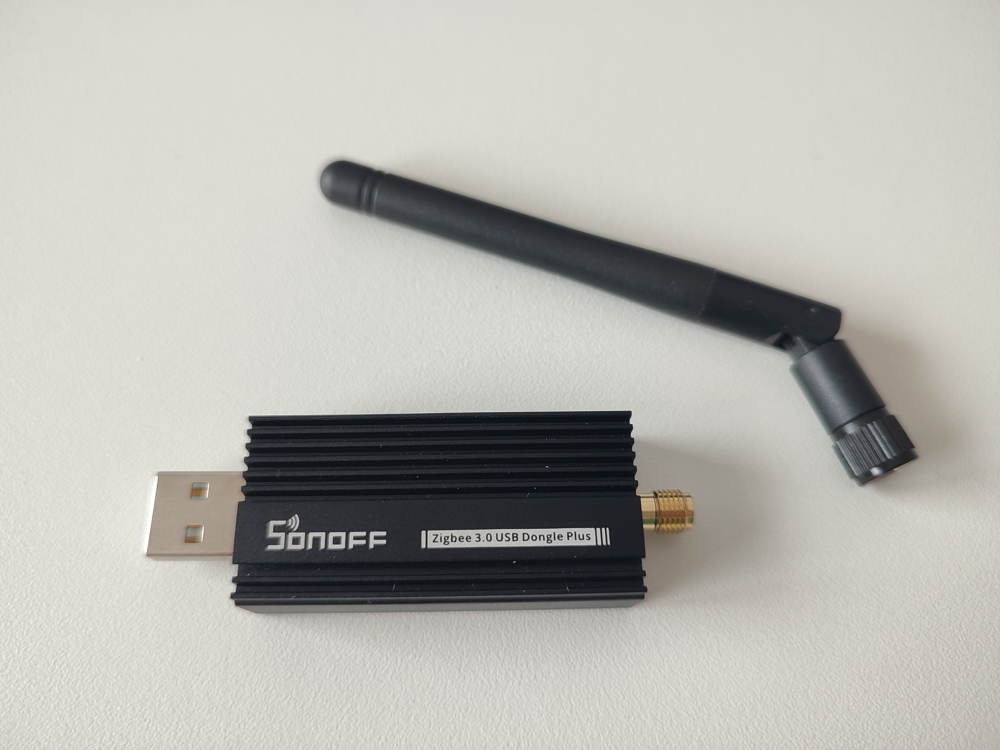

## Functionality

Great wireless performance - wall penetration, signal coverage and link quality.

It can be used as a coordinator, or as a router by flashing a different firmware.

The external antenna can be rotated to make it radiate in desired direction. For this antenna type, the best radiation and reception is perpendicularly to the stick - donut-like radiation pattern. 

### As a coordinator

I've got only short experience yet - just recently repaired all devices to it. So far everything works as fine as with Aeotec Zi-Stick ZGA008.

The link quality between coordinator and routers placed at same position as before is better with Sonoff ZBDongle-E stick than with Aeotec. Zi-Stick

### As a router

Great so far - used it for a couple of weeks already. It is handling many end devices without issues.

Disassembly is required for flashing and network repairing. Whether that's a pro or a con depends on use-case.

If you happen to run NixOS, I've prepared a document containing steps [how to flash it under NixOS](/how-to/flash-sonoff-zbdongle-e-as-router-under-nixos).

## Aesthetics

Quite big and bulky, which makes it to stand out if placed in plain sight. That's an expected cost to pay for a powerful Zigbee stick with an external antenna.

However, Sonoff made it look quite nice even if it's big and bulky.

## Internals

Disassembled device looks like this:

::image-gallery
{caption="Disassembled"}
{caption="Board top side"}
{caption="Board bottom side"}
::

## Box and packaging

Solid nice paper box with a manual, stick and antenna inside:

::image-gallery
{caption="Box Front"}
{caption="Box Back"}
{caption="Box Contents"}
::

## Summary

I am happy to trade compactness for great performance and reliability.

Great as a router, if there is a space available, where it won't stand out.

Seems great as a coordinator, too.
